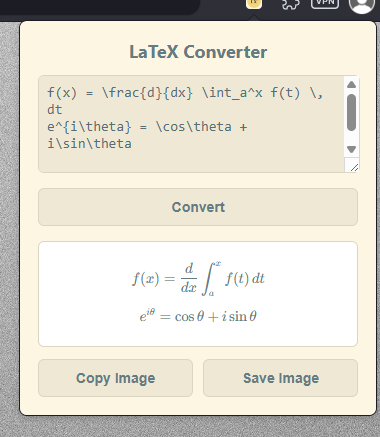

# LaTeX converter Chrome Extension

A simple Chrome extension to convert LaTeX expressions copyable images.

## Features

- **Copy to Clipboard:** Copy the rendered output as a PNG image.
- **Persistent Input:** Remembers your last-typed text, even after closing the popup.

## How to Install

1. Clone this repository or download it as a ZIP file.
2. Open Google Chrome and navigate to `chrome://extensions`.
3. Enable "Developer mode" in the top-right corner.
4. Click "Load unpacked" and select the project folder.